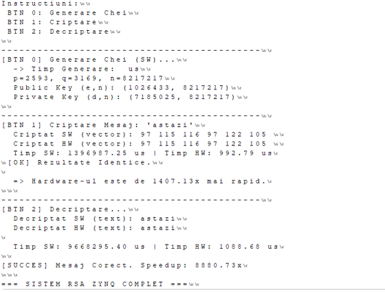

# Sistem de Autentificare bazat pe Criptografie Asimetrica (RSA)

Acest proiect implementeaza un sistem de autentificare securizat utilizand algoritmul RSA, optimizat prin accelerare hardware pe o platforma Xilinx Zynq-7000. Aplicatia demonstreaza un flux de proiectare complet, de la dezvoltarea de IP-uri personalizate prin High-Level Synthesis (HLS), pana la integrarea hardware-software in Vitis.

## Descriere Proiect

Scopul principal este reducerea timpului de executie pentru operatiile de exponentiere modulara, care reprezinta nucleul computational al algoritmului RSA. Sistemul foloseste partea de logica programabila (PL) a FPGA-ului pentru calcule intensive si sistemul de procesare (PS) bazat pe ARM pentru controlul fluxului de date si interfata cu utilizatorul.

## Functionalitati Tehnice

### 1. Accelerare Hardware (Programmable Logic)
* **Nucleu RSA HLS:** Implementarea functiilor critice in C++ si sintetizarea acestora folosind Vitis HLS pentru a crea un accelerator hardware eficient.
* **Optimizari:** Utilizarea directivelor de pragmă pentru pipeline si unrolling, optimizand latenta si throughput-ul operatiilor matematice pe numere mari.
* **Interfata AXI4-Lite:** Permite comunicatia bidirectionala intre procesor si accelerator pentru transferul operanzilor (baza, exponent, modul) si citirea rezultatului.

### 2. Integrare Software (Processing System)
* **Drivere Bare-metal:** Dezvoltarea software-ului in Vitis pentru gestionarea IP-ului de criptare.
* **Handshake de Autentificare:** Simularea unui protocol intre un client si un server pentru validarea identitatii prin semnaturi digitale.
* **Monitorizare Performanta:** Utilizarea timerelor hardware pentru masurarea precisa a timpului de executie in variantele software versus hardware.

## Rezultate Experimentale

Conform testelor efectuate, accelerarea hardware ofera o imbunatatire semnificativa a performantei:
* **Executie Software (ARM Cortex-A9):** Procesare secventiala cu latenta ridicata.
* **Executie Hardware (FPGA Fabric):** Reducerea timpului de calcul prin paralelizarea operatiilor de inmultire modulara.
* **Speedup:** Sistemul hibrid asigura o validare a mesajelor mult mai rapida decat o implementare pur software.

## Tehnologii Utilizate

* **Dezvoltare Hardware:** Xilinx Vivado (Block Design, IP Integrator).
* **Sinteza Inalta:** Vitis HLS (High-Level Synthesis).
* **Dezvoltare Software:** Xilinx Vitis Unified Software Platform.
* **Platforma Target:** Arhitectura Xilinx Zynq-7000 (ex: Digilent ZedBoard sau Zybo).
* **Limbaje:** C++ (HLS), C (Software Embedded).

## Structura Repository-ului

* `Hardware/` - Sursele Vitis HLS si proiectul Vivado (fisiere de constrangeri .xdc si wrapper-ul .xsa).
* `Software/` - Aplicatia C rulata pe procesorul ARM (helloworld.c, drivere IP core).

---
**Autor:** Mandroc Andrei Ovidiu
**Context:** Proiect realizat pentru disciplina Sisteme pe Cip (SoC).